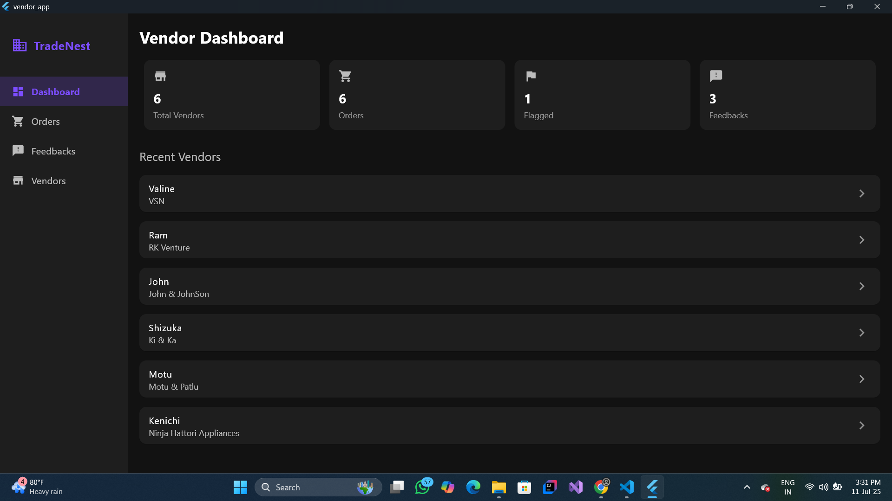
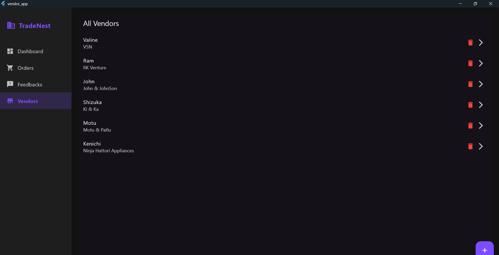
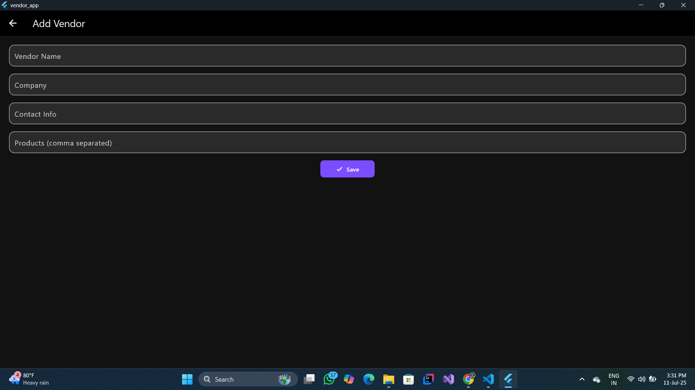

# 🛒 Vendor Management App

A modern and elegant Flutter-based Vendor Management System designed for managing vendors, orders, feedback, and activity status.  
This app uses a local SQLite database (`sqflite`) for offline storage and works across Android, Windows, and possibly Linux/Mac.

---

## ✨ Features

- 📋 Add, edit, and delete vendors
- 🛍️ Add and track orders for each vendor
- 💬 Submit and store feedback with ratings
- 🚩 Flag vendors as inactive (visually highlighted)
- 📊 Dashboard with real-time counts and recent vendor views
- 🌙 Dark-themed admin dashboard interface
- 💾 Local database with persistent storage

---

## 📸 Screenshots

| Dashboard | Vendor Detail | Add Vendor |
|----------|----------------|-------------|
|  |  |  |


---

## 🚀 Getting Started

### Prerequisites

- [Flutter SDK](https://flutter.dev/docs/get-started/install)
- Android Studio / VS Code
- A connected Android device/emulator OR Windows setup

---

### Run the App

```bash
git clone https://github.com/Valine25/vendor-management-app.git
cd vendor-management-app
flutter pub get
flutter run
```
---

### 🛠️ Tech Stack
- Flutter (UI Toolkit)
- Sqflite (Local Database)
- Path Provider
- Dart (Programming Language)

---


